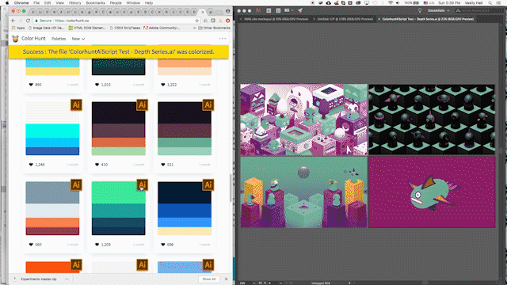
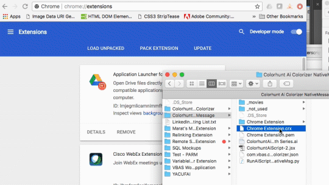
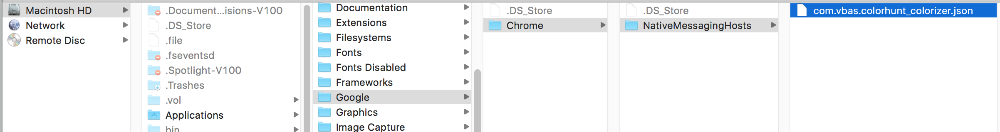

# Experimental Graphic Art Workflow Techniques 
## Chrome extension with Adobe Illustrator

A Google Chrome browser extension using Google's native messaging code can manipulate a desktop instance of Adobe Illustrator, empowering a graphic designer with workflows that can be driven by data from web interfaces. Along with an intranet web application, such an extension can be used to create and monitor graphic art workflows.

### Sample extension: Colorhunt Colorizer
This extension uses Illustrator's global colors to re-color a document's artwork by changing the values of those swatches to suit the input web data. The website [colorhunt.co](https://colorhunt.co) displays a gallery of user-created palettes as a grid of styled containers. The extension appends a new custom icon to each palette object with a click event, whose action sends the color data to a host python application on the user's computer. The python script passes the input data to an Illustrator extendscript by executing an applescript via an `osascript` command which calls the extendscript .jsx file.

Once the Illustrator file is manipulated by the .jsx script, the result message is transmitted back up the executing script chain to the Chrome browser tab, where it can be used to update the web page view. In this case, there is a yellow message bar which appears at the top of the window - it supplies the name of the document upon successful execution, or a short error summary.

## Setup
**This setup is for _Mac only_ at this time**

1. Install the extension .crx file by going to your Chrome browser and typing `chrome://extensions` into the URL bar and going there, then dragging the "Chrome Extension.crx" file right into the browser. 
2. Make a link to, or place the file "**ColorhuntAiScript-2.jsx**" into your "Documents/Adobe Scripts" folder.
3. Place the file "**RunAiScriptFromNativeMsg.py**" into your "Documents/Adobe Scripts" folder, too.
4. Edit the file "**com.vbas.colorhunt_colorizer.json**" to change the line `"path": "/Users/VasilyHall/Documents/Adobe Scripts/RunAiScriptFromNativeMsg.py",` to point to your own .py file in the location from step #3.
5. Place the file "**com.vbas.colorhunt_colorizer.json**" into the folder "/Library/Google/Chrome/NativeMessagingHosts". If this folder is not in your system, create it. 

## Usage
**Check initial website status**

Go to the website colorhunt.co](https://colorhunt.co) and ensure the extension is properly working: the color palette containers each should have an "Ai" button on the top-right corner.

**Prepare Illustrator template**

Create any Illustrator document with four global swatches whose names are exactly "place c1", "place c2", "place c3", and "place c4". Color some artwork with these swatches. Since the swatch color values are being manipulated by the extendscript, these global colors could be used to change appearance of stacked appearance fills or strokes, effects and graphic styles, and also blends.

**Action**

When clicking the Ai icons on the website, the extension should change the document colors and relay the name of the document back in the browser.

## Resources
The documentation for Google Chrome extensions's native messaging api is (or was) located at [this location (developer.chrome.com/extensions/nativeMessaging)](https://developer.chrome.com/extensions/nativeMessaging).